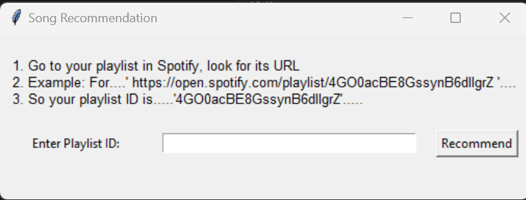
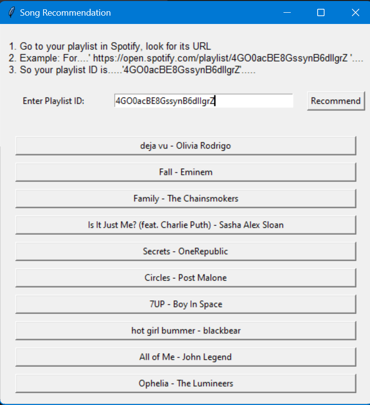

### README for Spotify Song Recommendation System

# Spotify Song Recommendation System

This project is a Python-based application that integrates the Spotify API to recommend songs from a user's playlist. It features a user-friendly GUI built with Tkinter and allows users to explore recommendations with direct links to Spotify.

---

### Application Preview

#### Initial Screen  


#### Recommendations Display  


---

## Features

- Authenticate with the Spotify API to fetch playlists.
- Generate personalized song recommendations based on personal playlist tracks.
- Display clickable links to recommended songs for easy access to Spotify.
- Ensure diversity in recommendations by avoiding duplicate artists.
- Simple and intuitive GUI for interaction.

---

## Getting Started

### Prerequisites

1. **Spotify Developer Account**  
   Create an app at the [Spotify Developer Dashboard](https://developer.spotify.com/dashboard/applications) to obtain:
   - `CLIENT_ID`
   - `CLIENT_SECRET`
   - `REDIRECT LINK` (Copy paste it from this code)

2. **Python 3.7 or Higher**  
   Ensure you have Python installed. Use [python.org](https://www.python.org/) to download and install the latest version if needed.

3. **Spotify Account**  
   A Spotify account is required (Spotify Premium is *not* necessary).

---

### Installation

1. **Clone the Repository**  

2. **Install Dependencies**  
   Use `pip` to install the required Python libraries:
   ```bash
   pip install -r requirements.txt
   ```

3. **Set Up Credentials**  
   - Create a file named `creds.py` in the project directory.
   - Add the following code:
     ```python
     CLIENT_ID = "your_client_id"
     CLIENT_SECRET = "your_client_secret"
     ```

4. **Run the Application**  

---

### Usage Instructions

1. **Enter Playlist ID**  
   Copy the playlist ID from the Spotify URL (e.g., `4GO0acBE8GssynB6dIIgrZ` from `https://open.spotify.com/playlist/4GO0acBE8GssynB6dIIgrZ`).

2. **Get Recommendations**  
   Enter the playlist ID in the GUI and click the "Recommend" button to generate song recommendations.

3. **Play Songs**  
   Click on any recommended song to open it in Spotify.


---

## Built With

- **Spotipy**: Python library for Spotify Web API.
- **Tkinter**: GUI framework for building the application.
- **scikit-learn**: Machine learning tools for generating recommendations.
- **pandas**: Data manipulation and analysis.

---

## License

This project is licensed under the MIT License - see the [LICENSE](LICENSE) file for details.

---

## Acknowledgments

- [Spotify Web API](https://developer.spotify.com/documentation/web-api/)
- [Spotipy Documentation](https://spotipy.readthedocs.io/)
- [Dataset from Kaggle](https://www.kaggle.com/datasets/unnatgupta/songs-dataset)

---

## Contributing

Contributions are welcome! Feel free to fork the repository and submit pull requests.

---